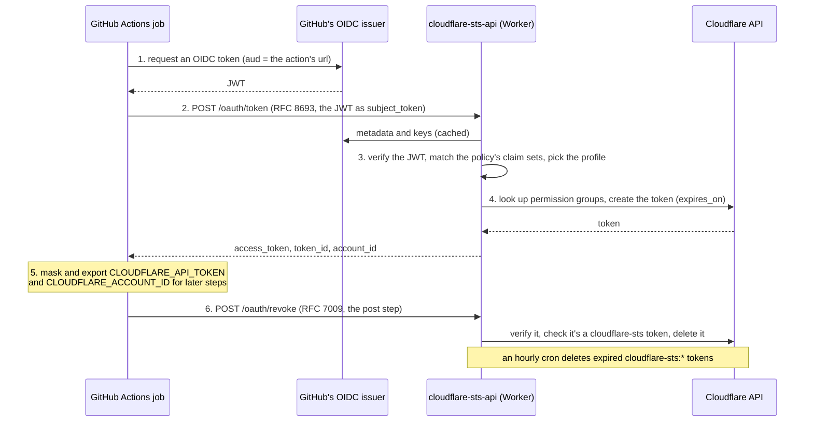

# cloudflare-sts

> A Security Token Service for Cloudflare. Keyless Cloudflare API access from
> GitHub Actions: a job trades its GitHub OIDC token for a short-lived,
> least-privilege Cloudflare API token, so no workflow stores a
> `CLOUDFLARE_API_TOKEN` secret.

[](https://github.com/cf-contrib/cloudflare-sts/actions/workflows/ci.yml)
[](https://www.rust-lang.org/)
[](https://www.typescriptlang.org/)
[](https://wiki.nixos.org/wiki/Flakes)
[](LICENSE)

> [!NOTE]
> **Pre-1.0.** The policy format and the broker API may still change between
> minor versions. cloudflare-sts fills a gap until Cloudflare trusts GitHub's OIDC
> issuer natively. When it does, swap the action and delete the broker.

```yaml
permissions:
  id-token: write

steps:
  - uses: cf-contrib/cloudflare-sts@v0.21.0 # x-release-please-version
    with:
      url: https://cloudflare-sts-api.example.com
      profile: example-org/app:ci.deploy
  - run: npx wrangler deploy # CLOUDFLARE_API_TOKEN + CLOUDFLARE_ACCOUNT_ID are set
```

| | Ships as | What it is |
|---|---|---|
| [`action`](action) | `uses: cf-contrib/cloudflare-sts@<version>` | The GitHub Action, in JavaScript with no runtime dependencies. Gets the job's OIDC token, exports the minted Cloudflare token, and revokes it at job end. |
| [`crates/cloudflare-sts-api`](crates/cloudflare-sts-api) | `index.js` + `index_bg.wasm.base64` in [Releases](https://github.com/cf-contrib/cloudflare-sts/releases) | The broker, a Cloudflare Worker written in Rust, in your account. Checks the OIDC token against your policy, and mints the Cloudflare token or R2 credentials, or signs a token for another service. |
| [`crates/cloudflare-sts-cli`](crates/cloudflare-sts-cli) | `nix profile install github:cf-contrib/cloudflare-sts` | The CLI, for people: `cloudflare-sts login`, then `cloudflare-sts exec --profile <profile> -- <command>` runs a command with the same environment the action sets, and revokes the token when it exits. |
| [`crates/cloudflare-sts-sdk`](crates/cloudflare-sts-sdk) | A Rust crate in this workspace; not published | The broker's HTTP API: its [TypeSpec](crates/cloudflare-sts-sdk/openapi/sts/v1/stsv1.tsp), the OpenAPI document compiled from it, and the types, server traits and client generated from it; hand-written beside them, the health endpoints. The Worker builds on it. |
| [`crates/cloudflare-sts-core`](crates/cloudflare-sts-core) | A Rust crate in this workspace; not published | OIDC tokens in Workers, verified and signed. The Worker builds on it, and cloudflare-nix can too. |
| [`deployment/terraform`](deployment/terraform) | `//deployment/terraform?ref=<version>` | Deploys the released Worker with your policy, its bindings and its cron. |

The action and the broker, with its Terraform module, are released together from one tag, so deploy the broker from the release whose action you use. The action talks only to the broker, never to the Cloudflare API.

The broker takes OIDC tokens from any issuer you list: GitHub Actions, GitLab CI, HCP Terraform, or, for people, an identity provider such as [Cloudflare Access](crates/cloudflare-sts-api#people). Who gets what is in the policy's claim sets, the same rules [cloudflare-nix](https://github.com/cf-contrib/cloudflare-nix) uses.

Other services can trust the broker too. A profile with an `audience` gets the caller a short-lived token the broker signs itself, for that service, which verifies it with the broker's published keys. [cloudflare-nix](https://github.com/cf-contrib/cloudflare-nix) is the first such service. See [Tokens for other services](crates/cloudflare-sts-api#tokens-for-other-services).

## How it works



The only long-lived credential is the broker's **Cloudflare token**: an account-owned token with **Account API Tokens Write**, plus R2 permissions if profiles hand out [prefix-limited R2 credentials](crates/cloudflare-sts-api#buckets) (e.g. one shared Terraform-state bucket, each repo limited to its own prefix). It lives in Cloudflare Secrets Store, bound to the Worker, so it never passes through Terraform or CI and never leaves the Worker.

## Do you need it?

A stored `CLOUDFLARE_API_TOKEN` never expires unless someone rotates it. It's usually over-scoped, anyone who can run a workflow that reads it can exfiltrate it, and nothing links a job to what the token did.

| Approach | Secret in GitHub | Token lifetime | Notes |
|---|---|---|---|
| API token as a GitHub secret | yes | long-lived | The status quo |
| Token in AWS/GCP Secret Manager, read via their OIDC | no | long-lived | Fine if you already use AWS/GCP; the Cloudflare token is still long-lived |
| [bounded-systems/cf-oidc-token-broker](https://github.com/bounded-systems/cf-oidc-token-broker) | no | short-lived | Same idea. The policy is code you edit and redeploy |
| **cloudflare-sts** | **no** | **short-lived** | Declarative policy, prebuilt release, automatic revoke |

If a stored secret is acceptable to you, it's less to run.

## Quick start

1. **Create the Cloudflare token.** In the Cloudflare dashboard, create an account-owned API token with **Account API Tokens Write** (plus R2 permissions for [buckets](crates/cloudflare-sts-api#buckets)), and store it in Secrets Store.
2. **Write a policy** that says which repos, branches and environments get which permissions. See the [broker's README](crates/cloudflare-sts-api#policy).
3. **Deploy the broker** with the [Terraform module](deployment/terraform), on workers.dev (a custom domain is optional), then check that `<url>/health/ready` returns `200`: the policy was accepted and the secrets can be read.
4. **Add the action** to a job with `permissions: id-token: write`. See the [action's README](action).

## Development

Everything runs inside the dev shell: `nix develop`, or the Dev Container.

```sh
(cd action && npm ci && npm run lint && npm run typecheck && npm test)   # the action
(cd crates/cloudflare-sts-sdk/openapi && npm ci && npm run generate)   # the OpenAPI document, after editing the .tsp
cargo fmt --all --check && cargo test                                    # the crates' unit tests
crates/cloudflare-sts-api/tests/run.sh                                 # the broker end to end, under wrangler dev
nix build .#default                                            # the CLI, as people install it
(cd deployment/terraform && tofu test)                                   # the Terraform module
```

Releases are cut by release-please from Conventional Commits. Each release is tagged `vX.Y.Z` and attaches the broker's `index.js`, `index_bg.wasm.base64` and their `SHA256SUMS`. Pin the action to a release tag or its commit SHA: before 1.0 there is no floating major tag, because minor releases may break.

## License

[MIT](LICENSE)
